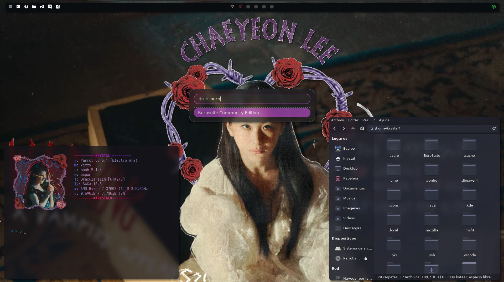

### Welcome!

This repo hosts a collection of dotfiles for various Linux applications.
The functionality of this environment is aimed at pentesting, and has been tested both in Arch and Parrot (currently the version I'm maintaining) as for the aesthetic section, is designed for those people who like dark and minimalist themes, although I then added a touch of "idols of kpop" this is completely optional and you are free to change it.

-----

### Screenshots

#### Default look 

#### BSPWM, Thunar , Rofi

#### Utilities for HTB at Polybar 

-----

### Pre-requisites and a little guide how to install

While I'm not going to give a detailed tutorial on how to install everything, I'm going to give a general overview of what you should do and common mistakes that are made when copying other people's dotfiles.

Once Parrot is installed you should install bspwm and sxhkd
[/baskerville/bspwm.git](https://github.com/baskerville/bspwm.git)

[/baskerville/sxhkd.git](https://github.com/baskerville/sxhkd.git)

Next would be a series of packages that I installed before I started copying dotfiles:
`sudo parrot-upgrade`
`sudo apt install cmake cmake-data pkg-config python3-sphinx libcairo2-dev libxcb1-dev libxcb-util0-dev libxcb-randr0-dev libxcb-composite0-dev python3-xcbgen xcb-proto libxcb- image0-dev libxcb-ewmh-dev libxcb-icccm4-dev libxcb-xkb-dev libxcb-xrm-dev libxcb-cursor-dev libasound2-dev libpulse-dev libjsoncpp-dev libmpdclient-dev libuv1-dev libnl-genl- 3-dev meson libxext-dev libxcb1-dev libxcb-damage0-dev libxcb-xfixes0-dev libxcb-shape0-dev libxcb-render-util0-dev libxcb-render0-dev libxcb-composite0-dev libxcb-image0- dev libxcb-present-dev libxcb-xinerama0-dev libpixman-1-dev libdbus-1-dev libconfig-dev libgl1-mesa-dev libpcre2-dev libevdev-dev uthash-dev libev-dev libx11-xcb-dev libxcb-glx0-dev
build-essential git vim xcb libxcb-util0-dev libxcb-ewmh-dev libxcb-randr0-dev libxcb-icccm4-dev libxcb-keysyms1-dev libxcb-xinerama0-dev libxcb-xinerama0- dev libasound2-dev libxcb-xtest0-dev libxcb-shape0-dev thunar imagemagick kitty neofetch feh lolcat picom zsh locate openvpn lxappearance neo4j bloodhound libc6-x32`

I then proceeded to install the polybar, lsd, bat powerlevel10k, zsh-autosuggestions, zsh-syntax-highlighting from their github repositories :
[https://github.com/polybar/polybar](https://github.com/polybar/polybar)

[/zsh-autosuggestions](https://github.com/zsh-users/zsh-autosuggestions/blob/master/INSTALL.md)

[/zsh-syntax-highlighting/](https://github.com/zsh-users/zsh-syntax-highlighting/blob/master/INSTALL.md)

[/romkatv/powerlevel10k](https://github.com/romkatv/powerlevel10k)

[/Peltoche/lsd](https://github.com/Peltoche/lsd)

[/sharkdp/bat](https://github.com/sharkdp/bat)

I also installed Vscode from their official website.

Then you can proceed to copy the configurations from my dotfiles to the respective directories, REMEMBER to read well the source code of each configuration, because it is thought about the directories which I worked, maybe you have paths that are different and you must tweak that, in my case most of the things were in my `/home/krystal/.config` or `/home/krystal/` as in the case of the `.p10k.zsh`  configuration for example.

In the case of the fonts, their default directory is `/usr/share/fonts`
Also remember to set the default shell to Zsh :

`sudo usermod - -shell /usr/bin/zsh root`

You can also use symbolic links so that your user's settings are shared with those of the root super user.

(in the root directory where the file to copy is)
`ln -s -f "path of the config file of the unprivileged user" "name of the file to link"`

In the case of VSCODE and Thunar aesthetic configuration, I used Dracula's theme
[https://draculatheme.com/](https://draculatheme.com/)
And then I implemented with lxappearance.

###### also for penetration testing utilities :

**crackmapexec :**

`sudo python3 -m pip install pipx`

`sudo pipx install crackmapexec`

**impacket :**
`pip install impacket==0.10.0`

**evil-winrm :**
https://github.com/Hackplayers/evil-winrm

-----

### Keybindings (some)

#BSPWM

**<kbd>win</kbd> + <kbd>ctrl</kbd> + <kbd>r</kbd>** = restart

**<kbd>win</kbd> + <kbd>enter</kbd>** = kitty term

**<kbd>win</kbd> + <kbd>shift</kbd> + [<kbd>1</kbd>...<kbd>9</kbd>]** = move the selected program to the selected environment [1,9].

**<kbd>win</kbd> + <kbd>w</kbd>** = close window

**<kbd>win</kbd> + <kbd>s</kbd>** = floating windows  

**<kbd>win</kbd> + <kbd>right click</kbd>** = resizes when in floating windows

**<kbd>win</kbd> + <kbd>left click</kbd>** = move the floating windows

**<kbd>win</kbd> + <kbd>d</kbd>** = Rofi program browser

**<kbd>win</kbd> + <kbd>ctrl</kbd> + [<kbd>1</kbd>...<kbd>9</kbd>]** = presets size

**<kbd>win</kbd> + <kbd>alt</kbd> + <kbd>ctrl</kbd> + <kbd>→</kbd>** = preset the area

#KITTY 

**<kbd>Ctrl</kbd> + <kbd>Shift</kbd> + <kbd>T</kbd>** = New tab

-----

### Contact me
Any doubt you can send me a message (English or Spanish) my idea is not to offer a detailed technical support if you don't know how to install, you can use this [readme.md](http://readme.md/) youtube and google-sempai first but in case that some file is corrupted, I have made a mistake, or I have not clarified something that is important you can communicate it to me.

-----

### Acknowledgment

Special thanks to [xndko](https://github.com/xndko), [Bleyom](https://github.com/bleyom) and [s4vitar](https://github.com/s4vitar) as this repository would not have been possible if I had not relied on their working environments.
